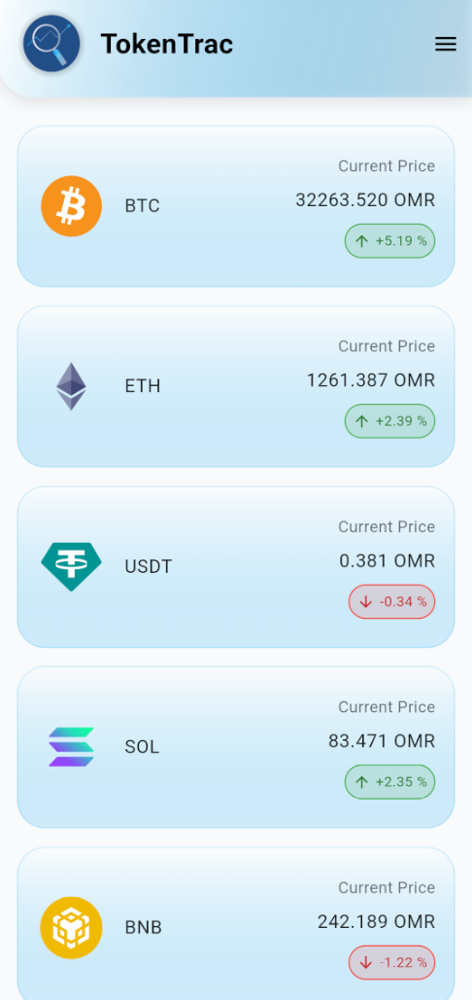
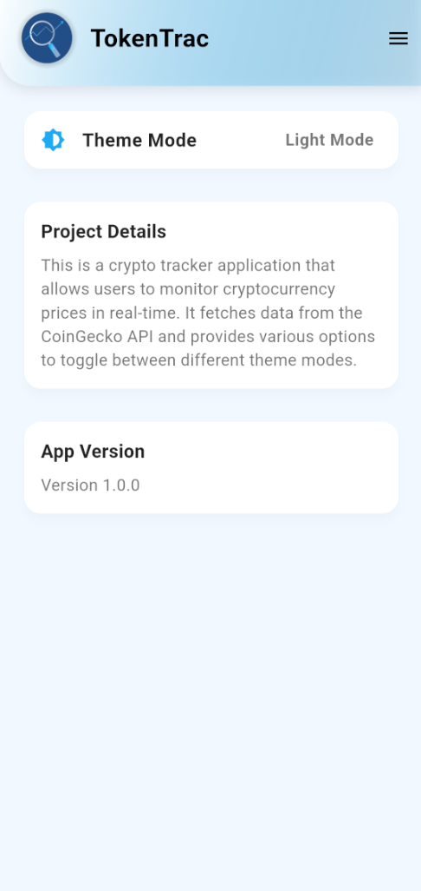
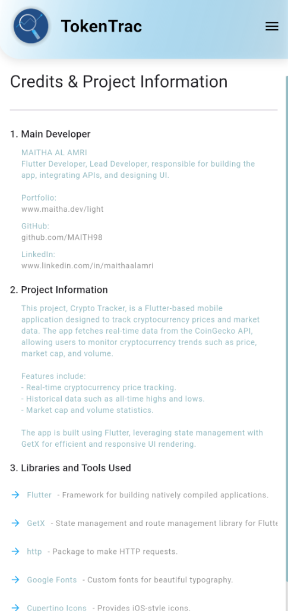

# Crypto Tracker App

A Flutter-based application that allows users to track cryptocurrency prices in real-time. This app pulls data from the CoinGecko API and provides an intuitive interface to monitor the latest cryptocurrency trends. 

## Features

- **Real-Time Cryptocurrency Data**: Fetch live data for various cryptocurrencies.
- **Customizable Themes**: Switch between Light and Dark modes.
- **Side Navigation Drawer**: Easy access to settings and credentials screen.
- **Smooth User Interface**: Beautiful UI designed for a seamless user experience.
- **Easy Navigation**: Navigate to different sections like Home, Settings, and Credentials easily.

## Screenshots

### Home Screen


### Settings Screen


### Side Navigation


## Installation

### Prerequisites

Make sure you have the following installed:

- Flutter (version 3.0 or above)
- Android Studio or Xcode (for Android/iOS emulation)
- Git (for cloning the repository)

### Steps to Run

1. Clone the repository:
   ```bash
   git clone https://github.com/MAITH98/crypto_tracker.git

   ```
2. Navigate to the project directory:
   ```bash
   cd crypto_tracker
   ```
3. Install dependencies:
   ```bash
   flutter pub get
   ```
4. Run the app on your preferred emulator or device:
   ```bash
   flutter run
   ```

## Technologies Used

- **Flutter**: The UI framework used to build the app.
- **Dart**: The programming language used to write the app.
- **CoinGecko API**: For fetching real-time cryptocurrency data.
- **GetX**: State management for theme switching and navigation.
- **Google Fonts**: For custom font styles.

## Contributing

Contributions are welcome! Feel free to fork the repository and submit pull requests.

### Steps to Contribute

1. Fork the repository.
2. Create a new branch for your feature/fix:
   ```bash
   git checkout -b feature-name
   ```
3. Commit your changes:
   ```bash
   git commit -m "Description of changes"
   ```
4. Push to your forked repository:
   ```bash
   git push origin feature-name
   ```
5. Open a pull request.

## License

This project is licensed under the MIT License - see the [LICENSE](LICENSE) file for details.

## Acknowledgments

- The app uses the [CoinGecko API](https://www.coingecko.com/en/api) for cryptocurrency data.
- Special thanks to the Flutter and Dart communities for their support and contributions.